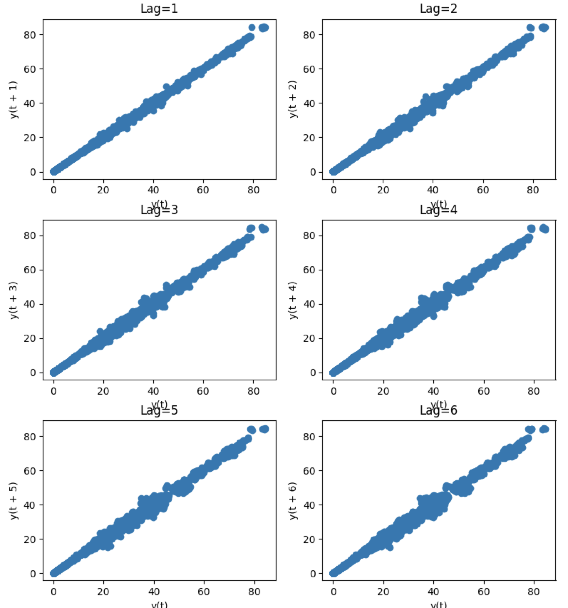
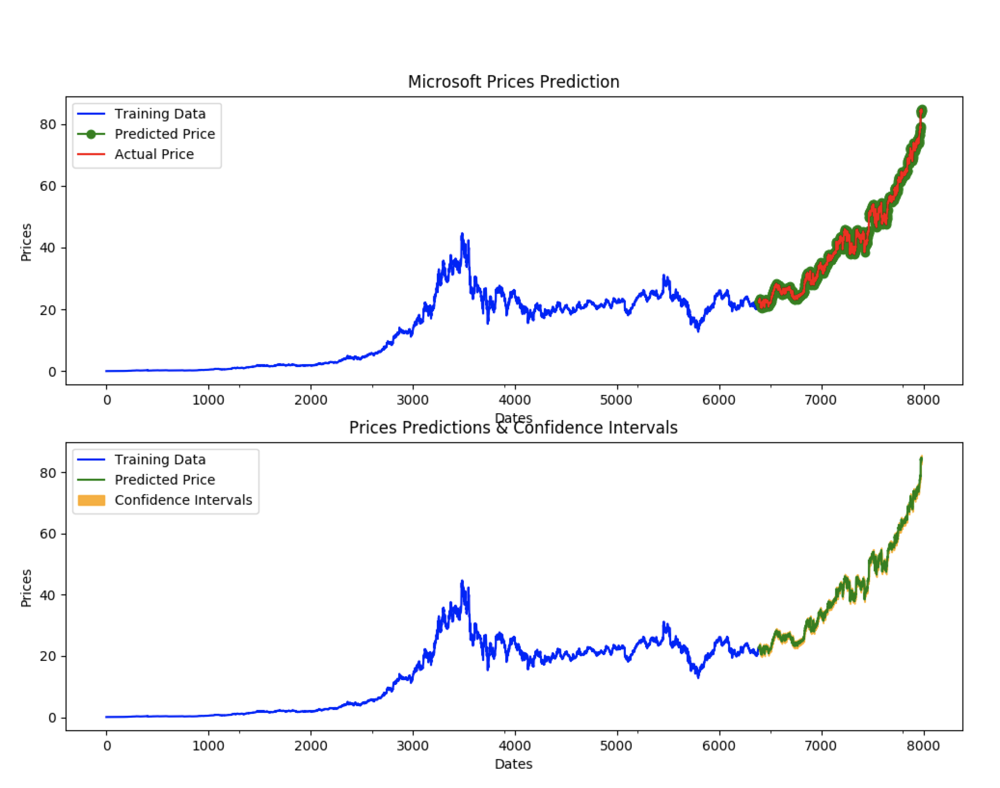

## Stock Market Prediction

A recent post on [Towards Data Science](https://towardsdatascience.com/stock-market-analysis-using-arima-8731ded2447a)
(TDS) demonstrated the use of ARIMA models to predict stock market data with raw statsmodels.
This post addresses the same problem using `pmdarima`'s
[auto-ARIMA](http://alkaline-ml.com/pmdarima/modules/generated/pmdarima.arima.auto_arima.html#pmdarima.arima.auto_arima),
and ends up achieving a different result with an even lower error rate.

Stock market analysis is always a hot topic, and it's the place many young data scientists'
minds go to first when they enter the field. Therefore, I feel I must caveat this post with
the warning that the stock market has been shown to be a [random walk](https://en.wikipedia.org/wiki/Random_walk),
and you should therefore take great care when attempting to forecast it via time series analysis.
However, it makes for a fun exercise.

### Imports & data loading

For this example, all we'll need is Numpy, Pandas, pmdarima & Matplotlib.
To run this example, you'll need pmdarima version 1.5.2 or greater. If you're
running this in a notebook, make sure to include `%matplotlib inline`, or the plots
will not show up under your cells!

This example was also designed for Python 3.6+. If you're running python 3.5, simply
remove the [F-string](https://www.python.org/dev/peps/pep-0498/) print statements and
it will work.


import numpy as np
import pandas as pd
import matplotlib.pyplot as plt
# %matplotlib inline

import pmdarima as pm
print(f"Using pmdarima {pm.__version__}")
# Using pmdarima 1.5.2


The pmdarima module conveniently includes the dataset we'll be using as an internal
utility. Rather than carting around `.csv` files, you can simply load the data from
the package:


from pmdarima.datasets.stocks import load_msft

df = load_msft()
df.head(3)


| Date       | Open    | High    | Low     | Close   | Volume     | OpenInt |
|------------|---------|---------|---------|---------|------------|---------|
| 1986-03-13 | 0.06720 | 0.07533 | 0.06720 | 0.07533 | 1371330506 | 0       |
| 1986-03-14 | 0.07533 | 0.07533 | 0.07533 | 0.07533 | 409569463  | 0       |
| 1986-03-17 | 0.07533 | 0.07533 | 0.07533 | 0.07533 | 176995245  | 0       |

### Data splitting

As with all statistical and ML modeling, we need to make sure we've split our data so
we can evaluate model performance on a hold-out set. However, unlike other traditional
supervised learning, time series models intrinsically introduce endogenous temporality,
meaning that the values at any given point $$y_{t}$$ in our time series likely have some
effect on some future value, $$y_{t+n}$$. Therefore, we cannot simply split our data
randomly; we must make a clean split in our time series (and exogenous variables,
if present). Newer versions of pmdarima make this very simple using the `train_test_split`.

As in the TDS example, we'll use `0.8 * dataSize` as our training sample.


from pmdarima.model_selection import train_test_split

train_len = int(df.shape[0] * 0.8)
train_data, test_data = train_test_split(df, train_size=train_len)

y_train = train_data['Open'].values
y_test = test_data['Open'].values

print(f"{train_len} train samples")
print(f"{df.shape[0] - train_len} test samples")
# 6386 train samples
# 1597 test samples


### Pre-modeling analysis

As you may know (if not, venture over to [pmdarima's tips-and-tricks doc](http://alkaline-ml.com/pmdarima/tips_and_tricks.html)
before continuing), an ARIMA model has 3 core hyper-parameters, known as "order":

* $$p$$: The order of the auto-regressive (AR) model (i.e., the number of lag observations)
* $$d$$: The degree of differencing.
* $$q$$: The order of the moving average (MA) model. This is essentially the size of the "window" function over your time series data.

Part of the science behind the auto-arima approach is intelligently finding the proper
combination of $$p$$, $$d$$, and $$q$$ such that you achieve the best fit. The TDS article took the
approach of fixing the $$p$$ parameter at 5 after examining auto-correlations with
lag plots. A [lag plot](https://www.statisticshowto.datasciencecentral.com/lag-plot/)
can provide clues about the underlying structure of your data:

* A linear shape to the plot suggests that an autoregressive model is probably a better choice.
* An elliptical plot suggests that the data comes from a single-cycle sinusoidal model.


from pandas.plotting import lag_plot

fig, axes = plt.subplots(3, 2, figsize=(8, 12))
plt.title('MSFT Autocorrelation plot')

# The axis coordinates for the plots
ax_idcs = [
    (0, 0),
    (0, 1),
    (1, 0),
    (1, 1),
    (2, 0),
    (2, 1)
]

for lag, ax_coords in enumerate(ax_idcs, 1):
    ax_row, ax_col = ax_coords
    axis = axes[ax_row][ax_col]
    lag_plot(df['Open'], lag=lag, ax=axis)
    axis.set_title(f"Lag={lag}")

plt.tight_layout()
plt.show()


As you can see, all the lags look fairly linear, so it's a good indicator that
an auto-regressive model is a good choice. But since we don't want to allow simple
visual bias to impact our decision here, we'll allow the `auto_arima` to select
the proper lag term for us.

#### Estimating the differencing term

The TDS article selected $$d=1$$ as the differencing term. But how did they
make that choice? With pmdarima, we can run several differencing tests against the
time series to select the best number of differences such that the time series will
be stationary.

Here, we'll use the [KPSS test](https://en.wikipedia.org/wiki/KPSS_test) and
[ADF test](https://en.wikipedia.org/wiki/Augmented_Dickey–Fuller_test), selecting
the maximum value between the two to be conservative. Fortunately, in this case, both
tests indicated that $$d=1$$ was the best answer, but in the case where they disagreed,
we could try both, selecting the best cross-validated result, or allow `auto_arima` to
auto-select the $$d$$ term.


from pmdarima.arima import ndiffs

kpss_diffs = ndiffs(y_train, alpha=0.05, test='kpss', max_d=6)
adf_diffs = ndiffs(y_train, alpha=0.05, test='adf', max_d=6)
n_diffs = max(adf_diffs, kpss_diffs)

print(f"Estimated differencing term: {n_diffs}")
# Estimated differencing term: 1


Therefore, we will use $$d=1$$.

### Fitting our model

Now it's time to let the `auto_arima` method do its magic. First however, let's examine
some of the hyper parameters we'll be setting:

* `seasonal`: If we were fitting a seasonal time series (of which the `pmdarima` package
  contains many: `lynx`, `wineind` & `sunspots` to name a few), we would set `seasonal=True`.
  This would also learn the $$P$$, $$D$$ and $$Q$$ hyper-parameters of the seasonal order. Fortunately,
  our time series is not seasonal in this example.
  
* `stepwise`: The stepwise algorithm will more intelligently select parameters for your ARIMA
  model, and tends to be faster than a random search. By default, this is true.
  
* `suppress_warnings`: MLE estimation can be noisy with warnings if something doesn't converge.
  In our case, we just want to ignore the warnings.
  
* `max_p`: We can set our model to cap out at a certain value of $$p$$ or $$q$$. In this case,
  we'll restrict the order of the AR model to be 6.
  
* `trace`: Controls the level of verbosity. 0 or False will not print, and 1 or above
  will print increasing levels of debug information.


auto = pm.auto_arima(y_train, d=n_diffs, seasonal=False, stepwise=True,
                     suppress_warnings=True, max_p=6, trace=2)


Notice that we preset `d=n_diffs`, since we've already settled on a value for $$d$$.
However, we're allowing our ARIMA models explore various values of $$p$$ and $$q$$.
After a few seconds, we arrive at the following solution:


print(auto.order)
# (0, 1, 0)


Where the TDS model was of order `(5, 1, 0)`, we ended up selecting a significantly
more simple model. But how does it perform?

### Updating the model

Now that the heavy lifting of selecting model hyper-parameters has been performed,
we can update our model by simulating days passing with our test set. For each new
observation, we'll let our model progress for several more iterations, allowing MLE to
update its discovered parameters and shifting the latest observed value. Then we can
measure the error on the forecasts. This can take a little while, since it's relatively
expensive to run several MLE steps and then evaluate a model repeatedly:


from sklearn.metrics import mean_squared_error
from pmdarima.metrics import smape

model = auto  # seeded from the model we've already fit

def forecast_one_step():
    fc, conf_int = model.predict(n_periods=1, return_conf_int=True)
    return (
        fc.tolist()[0],
        np.asarray(conf_int).tolist()[0])

forecasts = []
confidence_intervals = []

for new_ob in y_test:
    fc, conf = forecast_one_step()
    forecasts.append(fc)
    confidence_intervals.append(conf)

    # Updates the existing model with a small number of MLE steps
    model.update(new_ob)

print(f"Mean squared error: {mean_squared_error(y_test, forecasts)}")
print(f"SMAPE: {smape(y_test, forecasts)}")
# Mean squared error: 0.34238951346274243
# SMAPE: 0.9825490519101439


In the end, our model ended up way out-performing the TDS model!

| Source      | MSE     | SMAPE      |
|-------------|---------|------------|
| pmdarima    | 0.342   | 0.983 (!!) |
| TDS article | 0.343   | 40.776     |

### Viewing forecasts

Let's take a look at the forecasts our model produces overlaid on the actuals
(in the first plot), and the confidence intervals of the forecasts (in the second plot):


fig, axes = plt.subplots(2, 1, figsize=(12, 12))

# --------------------- Actual vs. Predicted --------------------------
axes[0].plot(y_train, color='blue', label='Training Data')
axes[0].plot(test_data.index, forecasts, color='green', marker='o',
             label='Predicted Price')

axes[0].plot(test_data.index, y_test, color='red', label='Actual Price')
axes[0].set_title('Microsoft Prices Prediction')
axes[0].set_xlabel('Dates')
axes[0].set_ylabel('Prices')

axes[0].set_xticks(np.arange(0, 7982, 1300).tolist(), df['Date'][0:7982:1300].tolist())
axes[0].legend()

# ------------------ Predicted with confidence intervals ----------------
axes[1].plot(y_train, color='blue', label='Training Data')
axes[1].plot(test_data.index, forecasts, color='green',
             label='Predicted Price')

axes[1].set_title('Prices Predictions & Confidence Intervals')
axes[1].set_xlabel('Dates')
axes[1].set_ylabel('Prices')

conf_int = np.asarray(confidence_intervals)
axes[1].fill_between(test_data.index,
                     conf_int[:, 0], conf_int[:, 1],
                     alpha=0.9, color='orange',
                     label="Confidence Intervals")

axes[1].set_xticks(np.arange(0, 7982, 1300).tolist(), df['Date'][0:7982:1300].tolist())
axes[1].legend()

plt.show()


### Conclusion

The TDS article provided an awesome example of how to use ARIMAs to predict stocks. My
hope in this example was to show how using pmdarima can simplify and enhance the models
you build. If you'd like to check out the project, head over to its [git repo](https://github.com/alkaline-ml/pmdarima).
We're always looking for new contributors!

